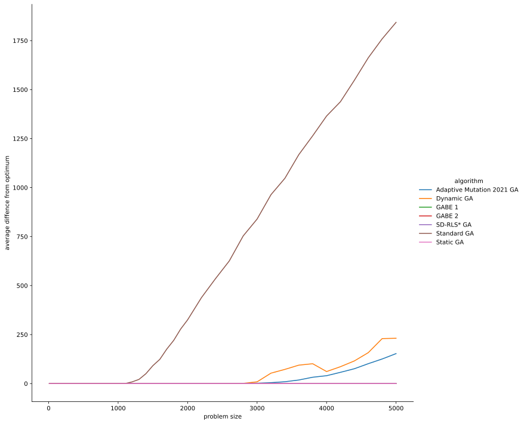

# A Framework for Self-Adaptive Genetic Algorithms
Master's Thesis By Benjamin Eriksen

## Overview
This folder contains the thesis itself, along with the program developed. The folders are structured as described in the following subsections.  

### framework
Contains the framework for implementing and testing gentic algorithms. The details about the structure is found in the thesis report.

### results
Contains the final results of the testing done in the folder final. These are arranged into files by the name of the problem and for some the external source of the problem instances.
Contains all plots used in the thesis report in the plots folder.

### documentation
Contains other plots and figures used in the thesis report.

### problems
Contains problem instances for TSP and 3-SAT problems. The sources are a subset of the problems available on [TSPLIB](http://comopt.ifi.uni-heidelberg.de/software/TSPLIB95/tsp/) and a subset of the Uniform Random-3-SAT collection from [SATLIB](https://www.cs.ubc.ca/~hoos/SATLIB/benchm.html). It also contains the optimal solutions for TSP instances, which are used to generate the goal.

### scripts
Contains the script for generating the test data used in the thesis report.

### data_analysis
Contains python scripts to manage results and generate plots.


## How to run
The external Makefile can be used to activate any of the test scipts used to generate the data for the thesis report(Beware! The running time is quite extensive).
```
make [onemax/leadingones/jumpm/tsn/3sat]
```
Alternatively the program can be run through the terminal. A few examples a shown below.
```
python3 src/main.py --problem OneMax --size 500 --goal 500 --time_limit 10 --algorithm ["GADynamic"] --sample_size 15
```
```
python3 framework/src/main.py --problem Sorting --size 10 --goal $n --SD_RLS_R 11 --time_limit 15 --algorithm ["GABE1,GABE2,GAAdaptiveMut,SD_RLS"] --mutation_operator k-swap --sample_size 15
```
```
python3 framework/src/main.py --problem ThreeSAT --problem_file uf20-018.cnf --time_limit 60 --sample_size 2 --algorithm ["GABE1,GABE2,GAAdaptiveMut,SD_RLS,GAStatic,GADynamic,GAStandard"] --SD_RLS_R 90
```

## Results


### OneMax



### LeadingOnes


### JumpM


### 3-Sat


### TSP


### Sorting


### SwapSorting

